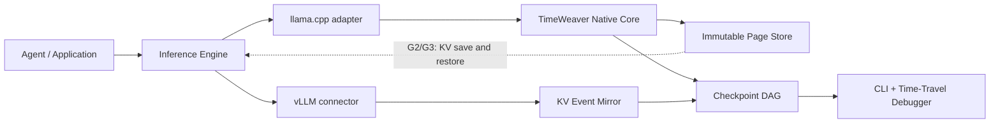
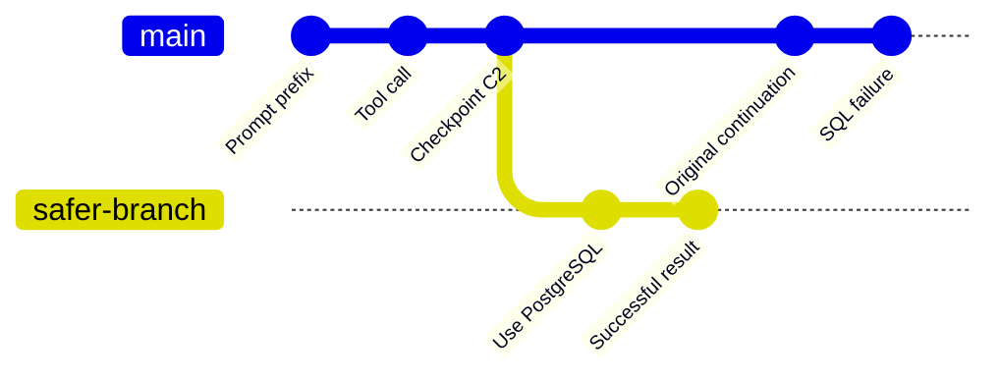
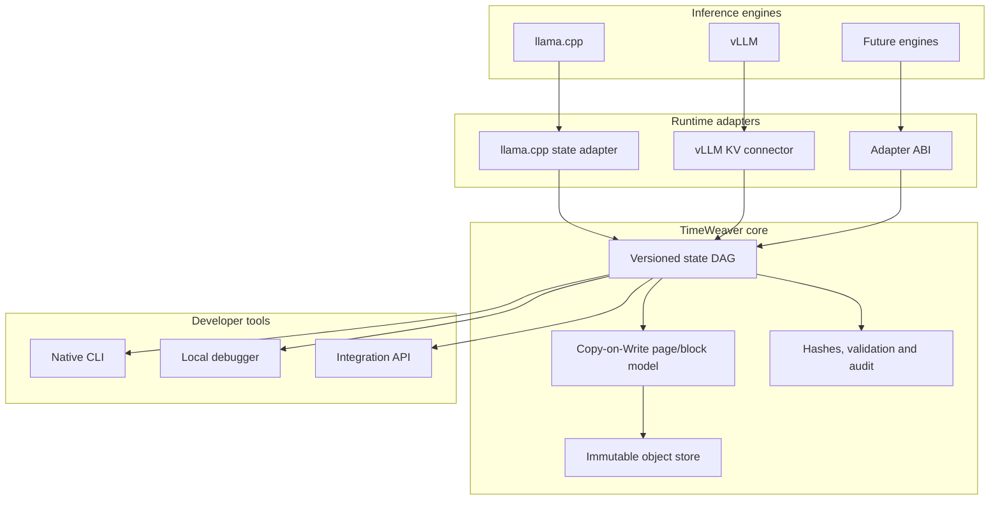
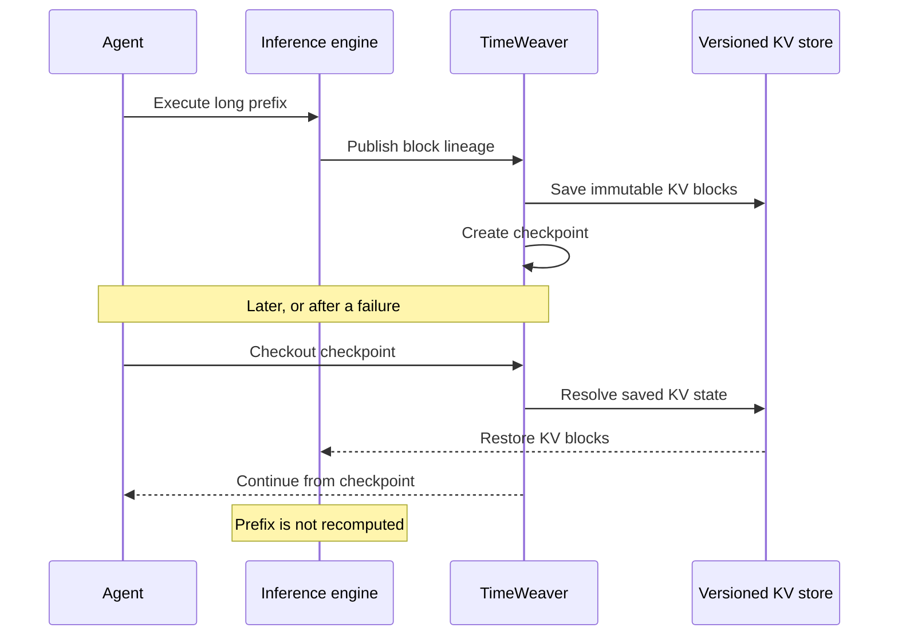

<div align="center">

# GNU TimeWeaver

### Fork the memory. Rewind the agent. Inspect every branch.

**A local-first time-travel debugger and versioned state runtime for LLM agents.**

> What if an agent could remember every version of its memory —
> and we could inspect, replay, restore and fork it?

<br>

[](LICENSE)


[Quickstart](#quickstart) ·
[What works today](#what-works-today) ·
[Architecture](#architecture) ·
[Research status](#research-status) ·
[Roadmap](#roadmap) ·
[Contributing](#contributing)

</div>

---

## Git for LLM runtime memory

Modern agents can run for hours, call dozens of tools and accumulate large inference states.

Then something goes wrong.

A bad tool call.
A hallucinated assumption.
A broken SQL query.
A branch worth exploring differently.

Today, the usual answer is:

```text
Start over and recompute everything.
```

TimeWeaver explores a different answer:

```text
Checkpoint it.
Inspect it.
Rewind it.
Fork it.
Continue from there.
```

GNU TimeWeaver versions agent and inference state as a directed acyclic graph, shares unchanged memory between descendants and provides the foundations for resuming an earlier state without recomputing its entire prefix.

Think of it as:

```text
git commit     → checkpoint agent state
git log        → inspect memory lineage
git checkout   → return to an earlier state
git branch     → explore another continuation
git diff       → understand what changed
```

---

## Why this matters

Long-running agents are difficult to debug because their behavior depends on everything that happened before the failure.

TimeWeaver is designed to make that history visible and actionable.

Potential applications include:

* debugging long-running agents;
* branching an agent before a critical decision;
* comparing multiple continuations from the same prefix;
* recovering workflows after failures;
* auditing how an agent reached a state;
* reproducible LLM experiments;
* persistent inference sessions;
* shared and deduplicated KV-cache infrastructure;
* reducing repeated prefix computation.

Some of these capabilities are operational today. Others depend on the KV payload save and restore milestones described below.

---

## What works today

### Local temporal-state runtime

The native CPU/mmap MVP provides:

* persistent checkpoint DAGs;
* immutable 4 KiB physical pages;
* Copy-on-Write descendants;
* zero-copy views over immutable mapped pages;
* checkpoint, fork and checkout operations;
* state hashing and structural validation;
* local CLI and browser debugger;
* measurable storage deduplication;
* crash-surviving file-backed state.

The bundled demonstration creates:

```text
9 checkpoints
144 logical page references
35 physical pages
~75.7% fewer snapshot bytes than full copies
```

### Real llama.cpp bridge

The real-model bridge has been executed against a pinned llama.cpp runtime and a local GGUF model.

Formal status:

```text
REAL_MODEL_BRIDGE_VERIFIED_WITH_LIMITATIONS
```

Verified properties include:

* real model execution;
* opaque runtime-state capture;
* exact restore at multiple prefix sizes;
* isolated continuation branches;
* zero prefix retokenization after restore;
* zero prefix re-decoding after restore;
* persistent object-store fault handling.

This validation is currently CPU-oriented and does not claim GPU or VRAM remapping.

### Real vLLM event lineage

TimeWeaver has also been connected to a pinned vLLM v0.23.0 engine.

Formal status:

```text
VLLM_EVENT_LINEAGE_VERIFIED_WITH_LIMITATIONS
```

Verified properties include:

* real `BlockStored` events;
* logical parent/child block lineage;
* branching after shared prefixes;
* real-frame deduplication;
* event sequence tracking;
* controlled sequence-gap detection;
* replay through the real vLLM replay endpoint;
* mirror restart and durable checkpoint recovery;
* byte-identical PUB and REPLAY payloads;
* independent offline lineage reconstruction.

Current vLLM scope remains:

```text
CPU-only
event_mirror_only
no KV payload persistence
no KV payload restore
no external prefix matching
BlockRemoved not exercised
AllBlocksCleared not exercised
```

---

## See the idea



The current implementation already versions native temporal state and reconstructs real vLLM block lineage.

The next protocols connect that lineage to the physical KV tensors.

---

## Branching an agent



Instead of erasing the failed execution, TimeWeaver keeps both histories.

The failure remains inspectable, while a corrected branch continues from the shared checkpoint.

---

## Quickstart

### Requirements

* Node.js 22 or newer;
* GCC or another C11 compiler available as `gcc` or `cc`;
* GNU/Linux, macOS or Windows;
* GNU/Linux is the primary production target.

Clone the repository and run:

```bash
npm run build
npm test
npm start
```

Open:

```text
http://127.0.0.1:7331
```

Select a checkpoint, edit its working prompt and press:

```text
Fork & resume
```

The included local demonstration intentionally creates an incorrect MySQL-style query for a PostgreSQL schema and then branches into a corrected continuation.

No cloud API, account, model download or network access is required for the local MVP.

---

## Native CLI

Create and inspect a temporal-state repository:

```bash
./build/timeweaver demo .timeweaver/manual
./build/timeweaver export .timeweaver/manual
./build/timeweaver validate .timeweaver/manual
```

Create a new branch from checkpoint `5`:

```bash
./build/timeweaver branch \
  .timeweaver/manual \
  5 \
  "Use PostgreSQL syntax only"
```

On Windows:

```powershell
build\timeweaver.exe demo .timeweaver\manual
```

---

## Architecture

TimeWeaver separates the model-independent versioning runtime from inference-engine-specific adapters.



The core does not depend on a specific model architecture.

Engine-specific knowledge — tensor layout, block IDs, KV slices and restore semantics — remains inside the adapter boundary.

---

## Research status

| Capability                                | Status                      |
| ----------------------------------------- | --------------------------- |
| Native temporal DAG                       | ✅ Verified                  |
| Immutable mmap page store                 | ✅ Verified                  |
| Copy-on-Write snapshots                   | ✅ Verified                  |
| Native checkpoint/fork/checkout           | ✅ Verified                  |
| Browser debugger and CLI                  | ✅ Operational               |
| Real llama.cpp bridge                     | ✅ Verified with limitations |
| Exact llama.cpp prefix restore            | ✅ Verified                  |
| Real vLLM KV events                       | ✅ Verified                  |
| vLLM branching lineage                    | ✅ Verified                  |
| vLLM sequence-gap replay                  | ✅ Verified                  |
| Byte-identical PUB/replay payloads        | ✅ Verified                  |
| Durable event-mirror restart              | ✅ Verified                  |
| Physical vLLM KV layout mapping           | 🧪 In progress              |
| Real KV payload persistence               | ⏳ Next milestone            |
| Real KV payload restore                   | 🗺️ Planned                 |
| Prefix continuation without recomputation | 🗺️ Planned                 |
| Native KV block fork/CoW                  | 🗺️ Planned                 |
| GPU and VRAM validation                   | 🗺️ Planned                 |

Current vLLM protocol work:

```text
v0.3.1 — event lineage and replay: PASS
v0.4.0 — physical layout and KV payload-save preparation: IN PROGRESS
```

---

## The final objective

The target workflow is:



The final goal is not merely to serialize a cache.

It is to make inference state:

```text
versionable
inspectable
recoverable
branchable
auditable
shareable
```

---

## Roadmap

### G2 — Save real KV payloads

* prove logical block hash → physical block ID mapping;
* identify the exact tensor slice for every layer;
* persist immutable per-layer KV objects;
* create complete block manifests;
* validate checksums and transactional writes.

Target conclusion:

```text
VLLM_KV_PAYLOAD_SAVE_VERIFIED_NO_RESTORE
```

### G3 — Restore and continue

* load compatible KV objects;
* restore them into vLLM's paged KV cache;
* announce externally available prefix tokens;
* continue generation from the restored state;
* prove that the restored prefix was not reprocessed.

### G4 — Native branching and Copy-on-Write

* restore one checkpoint;
* create multiple continuation branches;
* share immutable prefix blocks;
* isolate divergent suffixes;
* prove branch independence.

### Production work

* GPU and VRAM validation;
* concurrent requests;
* distributed storage;
* eviction and lifecycle events;
* compatibility policies;
* observability and operational tooling.

---

## Proof, not hype

TimeWeaver follows a strict rule:

> A capability is not considered implemented until it is exercised against a real runtime and produces independently auditable evidence.

The project distinguishes:

* implemented behavior;
* protocol preparation;
* observed runtime behavior;
* experimentally verified behavior;
* planned capabilities.

TimeWeaver does **not** currently claim:

* CUDA page-table manipulation;
* VRAM snapshotting;
* zero-copy GPU restore;
* real vLLM KV payload restore;
* external prefix matches;
* vLLM prefill avoidance;
* production-scale distributed operation.

The roadmap describes research targets, not completed capabilities.

---

## Reproduce the vLLM campaign

A pinned Linux/Docker environment is provided for the formal vLLM campaigns.

Prepare the frozen model snapshot at:

```text
models/qwen2.5-coder-0.5b-instruct/
```

Then run:

```bash
make vllm-image
make vllm-campaign
```

The topology separates:

```text
timeweaver-event-mirror
vllm-engine
campaign-runner
```

The model is mounted read-only and offline execution prevents silent model downloads.

Campaigns are versioned and preregistered. Raw results, hashes, protocol identifiers and limitations are preserved as evidence instead of being overwritten by later runs.

---

## Project philosophy

TimeWeaver is built around four ideas:

### Local first

A developer should be able to inspect and control agent state without sending it to an external service.

### Immutable history

Past checkpoints are not silently mutated. New behavior creates descendants.

### Engine-independent core

The versioning model remains separate from the details of llama.cpp, vLLM or future runtimes.

### Honest verification

Failures, limitations and inconclusive runs are preserved instead of being rewritten as successes.

---

## Documentation

* [Architecture](docs/ARCHITECTURE.md)
* [MVP scope](docs/MVP.md)
* [Product vision](docs/VISION.md)
* [Contributing](CONTRIBUTING.md)
* [License](LICENSE)
* [Protocols](docs/protocols/)

---

## Who is this for?

TimeWeaver may be useful to:

* AI infrastructure engineers;
* inference-engine developers;
* agent-framework maintainers;
* LLM observability teams;
* systems researchers;
* local-first AI developers;
* engineers working on persistent or long-running agents.

---

## Contributing

TimeWeaver is an experimental systems project with strict evidence requirements.

Contributions are especially welcome in:

* vLLM connector engineering;
* llama.cpp runtime integration;
* KV-cache serialization;
* agent debugging interfaces;
* GPU memory systems;
* distributed object storage;
* reproducible benchmarking;
* documentation and developer experience.

Before opening a pull request, read [CONTRIBUTING.md](CONTRIBUTING.md).

For implementation problems, open an issue.

For design questions, experiments and broader ideas, use GitHub Discussions.

---

## License

GNU TimeWeaver is free software licensed under the
[GNU Affero General Public License v3.0 or later](LICENSE).

The copyright holder may also offer AGPL-covered components under a separate commercial license.

TimeWeaver is not currently an official GNU package and does not claim endorsement by the GNU Project.

---

<div align="center">

### Agents should not have to forget everything just to try something different.

**Checkpoint. Rewind. Fork. Continue.**

</div>
